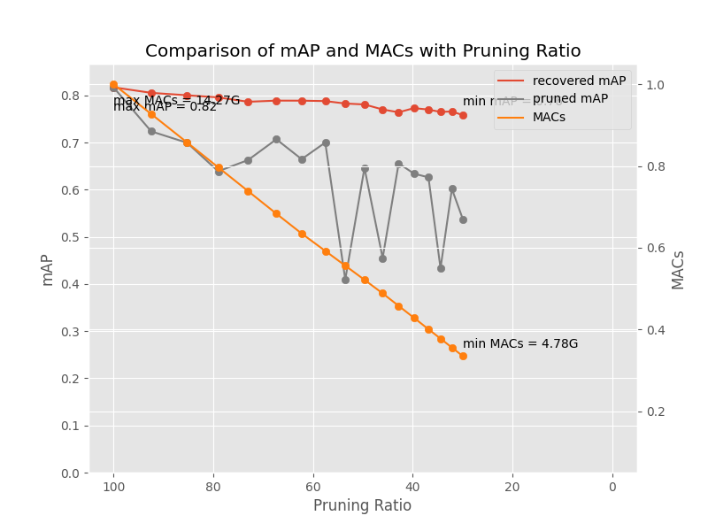

# Overview

This repository explores a pruning method using [Torch-Pruning](https://github.com/VainF/Torch-Pruning) and an algorithm named DepGraph, specifically applied to YOLOv8 on custom datasets.

For detailed technical information, please refer to the CVPR 2023 paper:

"[DepGraph: Towards Any Structural Pruning](https://arxiv.org/abs/2301.12900)."

# Quick Start  

## Step 1: Install Torch-Pruning

```bash
pip install torch-pruning
```

## Step 2: Train YOLOv8 on Your Custom Dataset

## Step 3: Modify `ultralytics/ultralytics/utils/loss.py`

Locate and edit the `v8DetectionLoss` class as shown below:

```python
class v8DetectionLoss:

    def bbox_decode(self, anchor_points, pred_dist):
        """Decode predicted object bounding box coordinates from anchor points and distribution."""
        if self.use_dfl:
            b, a, c = pred_dist.shape  # batch, anchors, channels
            # Ensure self.proj and pred_dist are on the same device
            self.proj = self.proj.to(pred_dist.device)
            pred_dist = pred_dist.view(b, a, 4, c // 4).softmax(3).matmul(self.proj.type(pred_dist.dtype))
            # Alternative method (commented out):
            # pred_dist = pred_dist.view(b, a, c // 4, 4).transpose(2,3).softmax(3).matmul(self.proj.type(pred_dist.dtype))
            # pred_dist = (pred_dist.view(b, a, c // 4, 4).softmax(2) * self.proj.type(pred_dist.dtype).view(1, 1, -1, 1)).sum(2)
        return dist2bbox(pred_dist, anchor_points, xywh=False)
```

## Step 4: Prune Your Pretrained YOLOv8 Model

- Download the `yolov8_pruning.py` script into the `path/to/ultralytics` directory. Then, run the script using the following command:

```bash
python yolov8_pruning.py
```

This script provides command-line options to customize settings for model pruning and fine-tuning.

The diagram below illustrates the performance metrics generated after executing the `yolov8_pruning.py` script:




 
